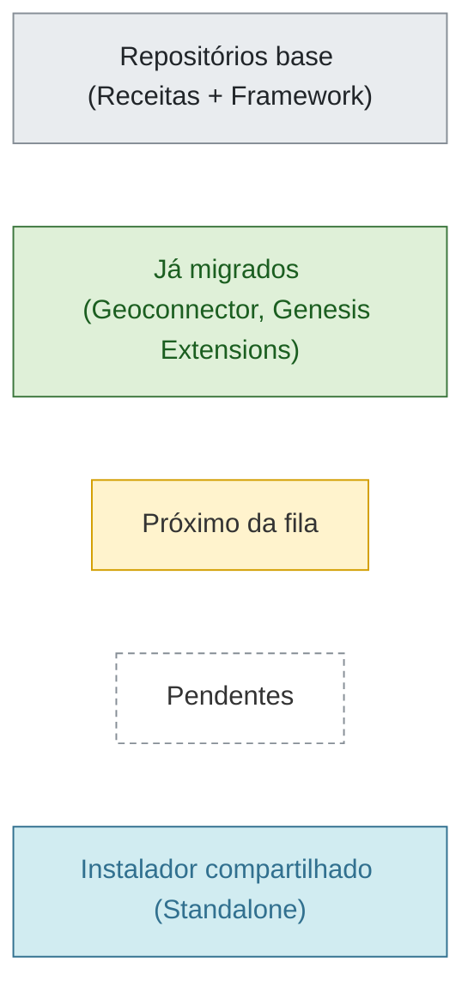

# Sequência de Migração para Conan 2 - Geral (v.1)

> Esse diagrama tem como propósito exibir o fluxo de migração dos repositórios dos projetos BrKin, AchillesBR, StratBR e SimBR para o Conan 2.



```mermaid
flowchart TD
    A["Receitas Conan 2<br/><small>s11524-modgeo-genesisplataforma-receitasconan2</small><br/><tiny>Qt/Qt5, Boost, DevKit, OpenInventor, terralib, GDAL, HDF5, SQLite, Gds, CGAL, Qwt, Eigen3, SWSolver, Gmsh, xerces-c, xsd, gtest, ninja, cmake, etc.</tiny>"]

    B["Genesis Framework<br/><small>s11524-modgeo-genesisplataforma-genesisframework</small>"]
    C["Geoconnector<br/><small>s11524-modgeo-genesisplugins-geoconnector</small>"]
    D["Genesis Extensions<br/><small>s11524-modgeo-genesisplugins-genesisextensions</small>"]

    E["Geologia<br/><small>s11524-modgeo-genesisplugins-geologia</small>"]
    F["<font color='#c62828' size='5'>★</font> BrKin<br/><small>s11899-modgeo-genesisplugins-geoquimica</small>"]

    G["Geoestatística<br/><small>s11436-modgeo-genesisplugins-geoestatistica</small>"]
    H["BSMIOX<br/><small>sibr-bsmiox</small>"]

    I["StratModeling<br/><small>s11436-modgeo-genesisplugins-modelagemestratigrafica</small>"]
    J["BSMIO<br/><small>sibr-bsmio</small>"]

    K["<font color='#c62828' size='5'>★</font> AchillesBR<br/><small>s11899-modgeo-genesisplugins-organicfacies</small>"]
    L["MeshGenerator<br/><small>sibr-meshgenerator</small>"]

    M["Fractal Analysis<br/><small>s11436-modgeo-genesisplugins-fractalanalysis</small>"]
    N["<font color='#c62828' size='5'>★</font> SimBR<br/><small>sibr-simbr</small>"]

    O["<font color='#c62828' size='5'>★</font> StratBR<br/><small>s11436-modgeo-genesisplugins-stratbr</small>"]

    Z["Standalone<br/><small>s11436-modgeo-genesis-standalone</small>"]

    classDef migrated fill:#dff0d8,stroke:#3c763d,color:#1b5e20
    classDef base fill:#e9ecef,stroke:#868e96,color:#212529
    classDef next fill:#fff3cd,stroke:#d39e00,color:#333
    classDef pending fill:none,stroke:#868e96,stroke-dasharray:4 3
    classDef standalone fill:#d1ecf1,stroke:#31708f,color:#31708f
    class A,B base
    class C,D migrated
    class E,F next
    class G,H,I,J,K,L,M,N,O pending
    class Z standalone

    A --> B --> C --> D
    D --> E & F

    E --> G & H
    H --> J --> L --> N --> Z

    G --> I
    I --> K
    K --> M & Z
    M --> O
    O --> Z

    F --> Z