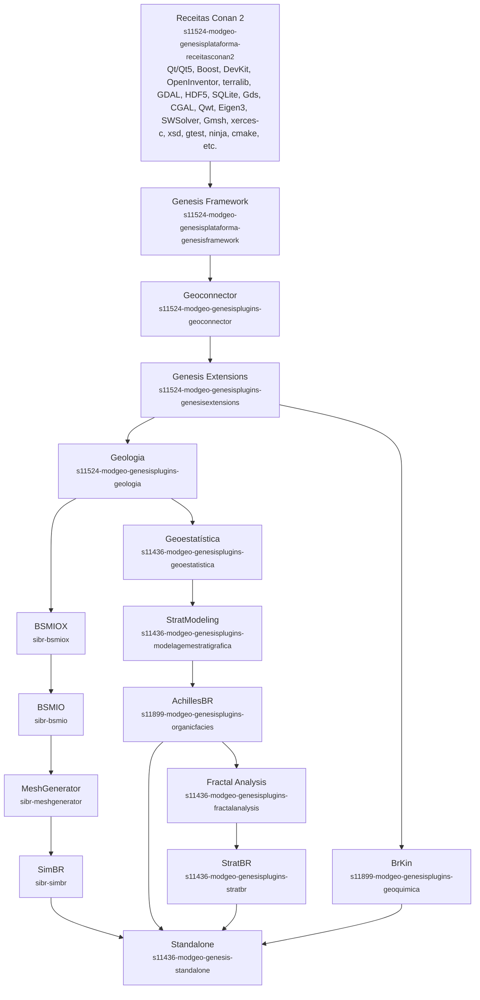

# Sequência de Migração para Conan 2 - Geral (v.1)

> Esse diagrama tem como propósito exibir o fluxo de migração dos repositórios dos projetos BrKin, AchillesBR, StratBR e SimBR para o Conan 2.

## Legenda

- **Repositórios base para Conan 2** — camada de fundo (Receitas + Framework)
- **Já migrados** — plugins de plataforma já transportados
- **Próximo repositório para migração** — próximo da fila
- **Repositórios não migrados** — pendentes
- **Repositório para instalador compartilhado** — `Standalone`

---

*Última atualização: 30/09/2026*

> A ordem de migração apresentada neste diagrama foi determinada através de análise automatizada dos repositórios e ordenação por prioridade ou dependências críticas. Não representa necessariamente a ordem de dependências explícitas dos conanfiles de cada projeto.